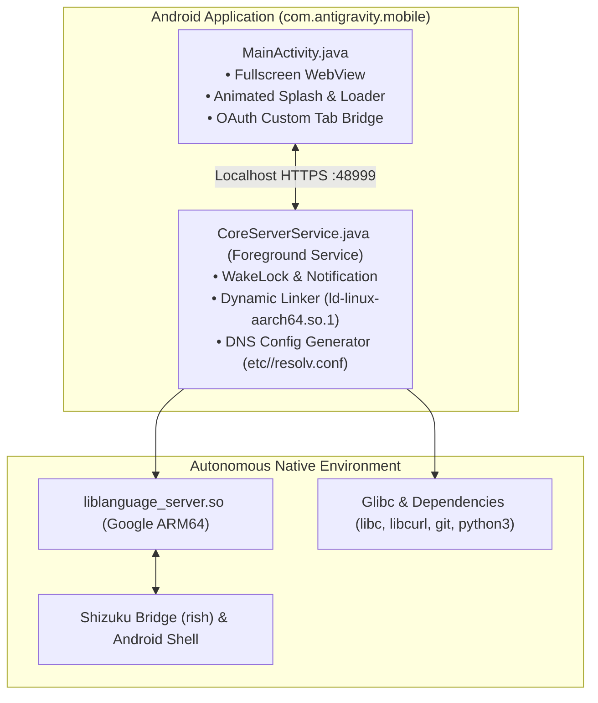

<h1 align="center">Antigravity Mobile (Android)</h1>

<p align="center">
  <b>Полностью автономный, 100% нативный ARM64 дистрибутив Google Antigravity в виде единого компактного Android APK без Termux, PRoot и виртуализации.</b>
</p>

<p align="center">
  <a href="LICENSE"></a>
  
  
  
  
</p>

<p align="center">
  <a href="#russian">🇷🇺 <b>Русский</b></a> &nbsp;|&nbsp; <a href="#english">🇬🇧 <b>English</b></a>
</p>

---

<a id="russian"></a>
## 🇷🇺 Описание проекта (Русский)

**Antigravity Mobile** — это открытый проект, упаковывающий полнофункциональный сервер **Google Antigravity Language Server** в единое нативное Android-приложение (APK). Больше не нужны сторонние эмуляторы терминалов (Termux), контейнеры PRoot или виртуализация: приложение устанавливается как обычный APK и работает прямо на железе вашего смартфона или планшета.

### 🌟 Ключевые возможности

- **100% Native ARM64 (Без просадок производительности):**
  - Никакой эмуляции системных вызовов (`ptrace`), замедляющей файловые операции и запуск процессов.
  - Нативное ядро пакуется как `liblanguage_server.so` в каталог `nativeLibraryDir`, строго соблюдая политики безопасности Android W^X (SELinux).
- **Мгновенный старт UI (Zero-Wait UI):**
  - При запуске моментально открывается чистый системный WebView с анимированным лоадером.
  - Ядро параллельно поднимается в защищённом `ForegroundService` с `WakeLock`. Как только локальный порт открыт — экран плавно переключается на рабочий стол Antigravity.
- **Бесшовный Google OAuth через Chrome Custom Tabs:**
  - Вход в Google-аккаунт перехватывается на лету и открывается в доверенном системном браузере (Chrome / Custom Tabs), полностью обходя запрет Google на авторизацию внутри WebViews.
  - После успешного входа Deep Link `antigravity://auth-success` мгновенно возвращает пользователя в приложение.
- **Встроенная автономная экосистема утилит:**
  - В APK зашит полный набор CLI-инструментов: `git`, `curl`, `ripgrep`, `python 3.14+`, `node`, `busybox`, `aapt`, `d8`, `apksigner`.
  - Встроен пакетный менеджер `pkg` для прямой загрузки пакетов без root и контейнеров.
- **Глубокая интеграция с Android через Shizuku (`rish`):**
  - Возможность управления системой без root-прав через Shizuku: установка и удаление пакетов (`pm`), снятие скриншотов (`screencap`), симуляция кликов и текста (`input tap / text`), чтение `logcat` и системных свойств.
- **Гибкий конвейер патчинга (Build & Patch Pipeline):**
  - Поддержка снятия региональных ограничений по флагу (`--bypass-region`).
  - Поддержка старых процессоров без инструкций LSE по флагу (`--armv8.0`).
  - Обход seccomp-фильтров ядра Android (`faccessat2` / `fchmodat2`).

---

### 🛠 Архитектура



---

### 📦 Структура репозитория

```text
antigravity-mobile/
├── app/                                    # Исходный код Android APK (Java)
│   ├── AndroidManifest.xml                 # Манифест (ForegroundService dataSync, Deep Links)
│   ├── src/main/java/com/antigravity/mobile/
│   │   ├── MainActivity.java               # Жизненный цикл UI, перехват OAuth, WebView
│   │   └── CoreServerService.java          # Фоновый сервис ядра, запуск линковщика и proc
│   └── res/                                # Иконки, темы и network security config
│
├── patches/                                # Модули бинарного патчинга ядра
│   ├── patch_gates.py                      # Снятие региональных проверок (--bypass-region)
│   ├── patch_armv80.py                     # Эмуляция LSE-атомиков для ARMv8.0 (--armv8.0)
│   ├── patch_resolv.py                     # Патч DNS resolver (etc//resolv.conf)
│   ├── patch_syscalls.py                   # Seccomp bypass (faccessat2 / fchmodat2)
│   ├── patch_auth.py                       # Перехват Google OAuth и возврат через Deep Link
│   └── patch_runner.py                     # Оркестратор конвейера патчинга с SHA-256
│
├── runtime/                                # Нативный рантайм, пакуемый в assets
│   └── src/
│       ├── certs/ca-certificates.crt       # SSL корневые сертификаты
│       ├── etc/bashrc                      # Окружение Bash и алиасы вызовов через linker
│       ├── glibc/                          # Нативные ELF библиотеки ARM64
│       ├── python/stdlib.zip               # Стандартная библиотека Python
│       ├── seed/                           # Начальные настройки и конфигурации
│       └── tools/                          # CLI инструменты (git, curl, rg, rish, busybox)
│
├── tools/                                  # Инструменты сборки (android.jar, r8.jar, keystore)
├── build.sh                                # Главный скрипт сборки в один клик
└── README.md                               # Документация проекта
```

---

### 🚀 Инструкция по сборке

#### Требования:
Для сборки прямо на Android (или в Linux ARM64) необходимы: `aapt`, `javac`, `java`, `zip`, `zipalign`, `apksigner`, `python3`. Все они уже включены в рантайм проекта.

#### 1. Подготовка ядра
Поместите оригинальный 64-битный бинарник Google Antigravity `language_server` в каталог `core/`:
```bash
mkdir -p core
# Скопируйте language_server в core/language_server
```

#### 2. Запуск сборки
```bash
# Стандартная чистая сборка:
./build.sh

# Снятие региональных экранов доступности (eligibility gates):
./build.sh --bypass-region

# Сборка для старых процессоров (ARMv8.0 без LSE):
./build.sh --armv8.0

# Комбинированная сборка со всеми оптимизациями:
./build.sh --bypass-region --armv8.0
```

Готовый подписанный файл появится по пути: `output/Antigravity-Mobile.apk`.

---

<a id="english"></a>
## 🇬🇧 Project Description (English)

**Antigravity Mobile** is an open-source project packaging the complete **Google Antigravity Language Server** into a single, native Android APK. It eliminates the need for terminal emulators (Termux), PRoot containers, or virtualization: install the APK and run Antigravity directly on your smartphone or tablet hardware.

### 🌟 Key Highlights

- **100% Native ARM64 (Zero Performance Penalty):**
  - No slow `ptrace` syscall emulation layers.
  - The core is packaged as `liblanguage_server.so` in `nativeLibraryDir`, fully compliant with Android W^X and SELinux policies.
- **Zero-Wait UI Launch:**
  - System WebView opens instantly with an animated loader upon launch.
  - Backend core initializes in a background `ForegroundService` with `WakeLock`. Once the localhost port is ready, the view smoothly cross-fades into the full Antigravity desktop.
- **Seamless Google OAuth via Chrome Custom Tabs:**
  - Google sign-in prompts are intercepted and redirected to the system browser (Chrome / Custom Tabs), bypassing Google's restrictions on in-WebView authentication.
  - Deep Link `antigravity://auth-success` automatically returns the user back to the application upon success.
- **Embedded Autonomous CLI Suite:**
  - Bundled with: `git`, `curl`, `ripgrep`, `python 3.14+`, `node`, `busybox`, `aapt`, `d8`, `apksigner`.
  - Built-in `pkg` tool for installing additional packages without root.
- **Android System Integration via Shizuku (`rish`):**
  - Shell access without root: manage packages (`pm`), capture screenshots (`screencap`), simulate input events (`input tap / text`), inspect logs (`logcat`).
- **Configurable Patch Pipeline:**
  - Optional regional eligibility bypass flag (`--bypass-region`).
  - Optional legacy CPU compatibility flag for chips lacking LSE atomics (`--armv8.0`).
  - Kernel seccomp filter bypass (`faccessat2` / `fchmodat2`).

---

### 🚀 Build Instructions

#### 1. Place Core Binary
Place your original Google Antigravity ARM64 binary into `core/`:
```bash
mkdir -p core
# Copy language_server into core/language_server
```

#### 2. Run the Build Script
```bash
# Standard clean build:
./build.sh

# Bypass Google regional eligibility gates:
./build.sh --bypass-region

# Build for older ARMv8.0 chipsets (Snapdragon 660/820, Exynos 8890, Cortex-A53/A72):
./build.sh --armv8.0

# Combined build:
./build.sh --bypass-region --armv8.0
```

The resulting signed APK will be output to: `output/Antigravity-Mobile.apk`.

---

## 📜 License

Distributed under the **Apache License 2.0**. See [`LICENSE`](LICENSE) for more information.
