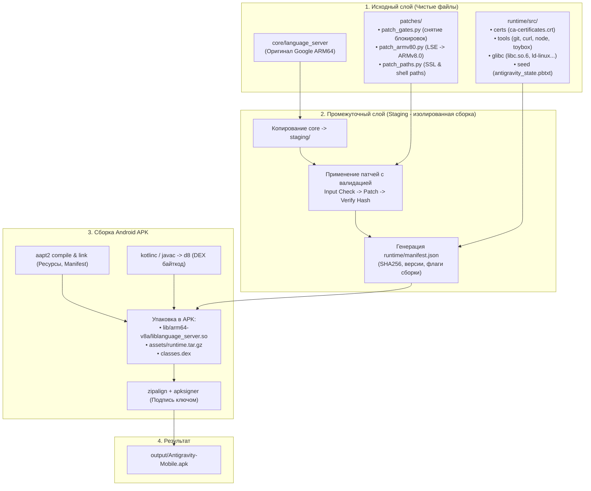

# Antigravity Mobile

Полностью автономный, нативный дистрибутив **Google Antigravity** в виде единого компактного Android APK без использования Termux, PRoot и виртуализации.

---

## 1. Главные принципы архитектуры

1. **Модульность и лёгкость обновления:**
   - Оригинальный бинарник `language_server` кладётся в папку `core/` и **никогда не модифицируется напрямую**.
   - Сборка копирует файлы в `staging/`, где детерминированно применяются патчи с проверкой контрольных сумм.
   - Обновление ядра: заменяем файл в `core/` и запускаем `./build.sh`.
2. **Максимальная производительность (100% Native ARM64):**
   - Никаких прослоек эмуляции syscall'ов (`ptrace`), замедляющих диск и запуск процессов в 3–5 раз.
   - Ядро пакуется как `liblanguage_server.so` в `nativeLibraryDir` приложения, что полностью удовлетворяет политике Android W^X (SELinux).
3. **Мгновенный старт UI (Zero-Wait UI):**
   - WebView открывается сразу при клике на иконку (показывая плавный локальный лоадер).
   - Ядро стартует параллельно в `ForegroundService`. Как только порт открыт — WebView плавно переключается на рабочий стол Antigravity.
4. **Бесшовный Google OAuth вход:**
   - Веб-интерфейс крутится внутри полноэкранного системного WebView.
   - При нажатии на кнопку входа Google ссылка перехватывается и открывается в доверенном системном браузере (Chrome / Custom Tabs), обходя запрет Google на авторизацию в WebViews.
   - В рантайм встроены корневые сертификаты (`ca-certificates.crt`), исключающие ошибку `Failed to fetch`.
5. **Полная автономность агента:**
   - Внутри APK зашит минимальный автономный набор CLI-утилит: `git`, `curl`, `ripgrep`, `node`, `toybox/busybox`.
   - Встроен прямой мост к **Shizuku** (`rish` / `adb-sh`) для управления Android-устройством без root-прав (установка APK, логирование, эмуляция сенсорного ввода).

---

## 2. Схема конвейера сборки (Build & Patch Pipeline)



---

## 3. Схема работы Android-приложения (Kotlin Runtime)

```mermaid
graph TD
    subgraph APP_LAUNCH["Запуск приложения"]
        UserClick(("Пользователь открыл иконку"))
        MainActivity["MainActivity.kt<br/>(Lifecycle & Container)"]
        UserClick --> MainActivity
    end

    subgraph UI_PARALLEL["Параллельный поток 1: Интерфейс (0 мс задержки)"]
        WebViewHost["WebViewHost.kt<br/>(Настройки WebView, touch/IME, WebSocket)"]
        LocalSplash["Локальный экран ожидания:<br/>'Antigravity запускается...'"]
        OAuthManager["OAuthManager.kt<br/>(Перехват accounts.google.com -> Chrome)"]
        
        MainActivity --> WebViewHost
        WebViewHost --> LocalSplash
        WebViewHost --> OAuthManager
    end

    subgraph CORE_PARALLEL["Параллельный поток 2: Backend Ядро"]
        CoreService["CoreServerService.kt<br/>(Foreground Service + WakeLock)"]
        RuntimeManager["RuntimeManager.kt<br/>(Проверка manifest.json, распаковка certs/tools)"]
        CoreProcess["ProcessBuilder<br/>(nativeLibraryDir/liblanguage_server.so)"]
        CoreStatus["CoreStatus.kt<br/>(StateFlow: Starting -> Running -> Ready)"]
        
        MainActivity --> CoreService
        CoreService --> RuntimeManager
        RuntimeManager --> CoreProcess
        CoreProcess --> CoreStatus
    end

    subgraph SYNC["Точка синхронизации"]
        CoreStatus -->|Статус: READY (порт открыт)| WebViewHost
        WebViewHost -->|Переключение с заставки на| LiveUI["https://127.0.0.1:45157/?csrf_token=...<br/>(Полноценный интерфейс Antigravity)"]
    end

    subgraph DEVICE_ACCESS["Мост к системе Android"]
        ShizukuBridge["ShizukuBridge.kt<br/>(Вызовы ADB shell / rish / pm / input / screencap)"]
        CoreProcess <-->|PATH: adb-sh / rish| ShizukuBridge
    end
```

---

## 4. Структура проекта

```text
antigravity-mobile/
├── core/                                   # 1. Оригинальные файлы (не изменяются)
│   └── language_server                     # Исходный бинарник Google ARM64
│
├── staging/                                # 2. Рабочая папка сборки (изолированная)
│   ├── build/
│   └── patched_core/
│
├── patches/                                # 3. Модули патчинга
│   ├── patch_gates.py                      # Снятие региональных ограничений (опционально: --bypass-region)
│   ├── patch_armv80.py                     # Замена LSE инструкций на пары ldaxr/stlxr (опционально: --armv8.0)
│   ├── patch_resolv.py                     # DNS resolver патч
│   ├── patch_syscalls.py                   # Seccomp bypass (faccessat2/fchmodat2)
│   ├── patch_auth.py                       # Перехват OAuth и Deep Link
│   └── patch_runner.py                     # Оркестратор проверки и наложения патчей
│
├── runtime/                                # 4. Автономное окружение для ИИ
│   └── src/
│       ├── certs/ca-certificates.crt       # SSL сертификаты для доступа в Google Cloud
│       ├── etc/                            # Конфигурация shell (bashrc) и resolv.conf
│       ├── glibc/                          # Нативные библиотеки ARM64 (glibc, libcurl, git, node...)
│       ├── python/                         # Стандартная библиотека Python
│       ├── seed/                           # Начальное состояние онбординга и настройки
│       └── tools/                          # CLI инструменты (git, curl, rg, busybox, rish, sdk)
│
├── app/                                    # 5. Исходный код Android APK (Java)
│   ├── AndroidManifest.xml                 # Разрешения W^X, ForegroundService (dataSync), Deep Links
│   ├── src/main/java/com/antigravity/mobile/
│   │   ├── MainActivity.java               # Жизненный цикл, WebView UI, перехват OAuth в Custom Tabs
│   │   └── CoreServerService.java          # Фоновый сервис ядра, WakeLock, запуск linker и proc
│   └── res/
│       ├── drawable/                       # Ресурсы и иконка приложения
│       └── xml/network_security_config.xml # Разрешение локального loopback сетевого взаимодействия
│
├── build.sh                                # 6. Единый скрипт сборки «в один клик»
├── README.md                               # 7. Документация архитектуры проекта
└── output/                                 # 8. Каталог готовой продукции
    └── Antigravity-Mobile.apk
```

---

## 5. Инструкция по сборке

1. Поместите оригинальный ARM64 бинарник `language_server` в каталог `core/`.
2. Запустите сборку:
   ```bash
   ./build.sh
   ```
   *Опциональные флаги сборки:*
   - `./build.sh --bypass-region` — включить патч снятия региональных ограничений Google (eligibility / region gates).
   - `./build.sh --armv8.0` — включить патч совместимости со старыми процессорами ARMv8.0 (Snapdragon 660/820, Exynos 8890, Cortex-A53/A72/A73 без LSE).
   - Можно комбинировать: `./build.sh --bypass-region --armv8.0`
3. Готовый подписанный пакет появится в:
   `output/Antigravity-Mobile.apk`.

---

## 6. Ключевые компоненты и патчи

1. **Бинарные патчи ядра (`patches/`):**
   - `patch_runner.py` — оркестратор конвейера патчинга с проверкой SHA-256.
   - `patch_gates.py` (флаг `--bypass-region`) — снятие региональных экранов проверки доступности и CLI gate.
   - `patch_resolv.py` — перенаправление путей DNS resolver (`/etc/resolv.conf` -> `etc//resolv.conf` в контексте `filesDir`).
   - `patch_syscalls.py` — обход seccomp-фильтров ядра Android (замена заблокированных `faccessat2` / `fchmodat2` на стандартные системные вызовы).
   - `patch_auth.py` — перехват `auth-success` и трансляция в Deep Link `antigravity://auth-success` для мгновенного закрытия Custom Tab браузера.
   - `patch_armv80.py` (флаг `--armv8.0`) — замена LSE-атомиков на пары LL/SC и обход Google fail-fast проверок.

2. **Мобильное Android-приложение (`app/`):**
   - Написано на Java/Android API без тяжелых зависимостей.
   - Запускает ядро в `CoreServerService` (`ForegroundService`) с независимым `WakeLock`.
   - Полноэкранный `WebView` с бесшовным открытием интерфейса и перехватом Google OAuth в Chrome Custom Tabs.
   - Полная интеграция с Shizuku (`rish`) для системного управления Android.
