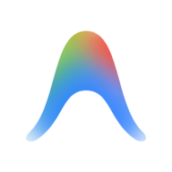
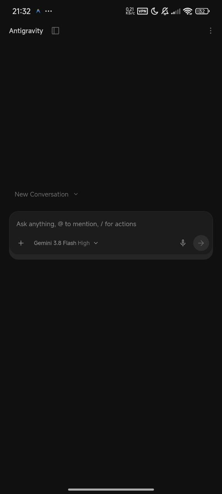
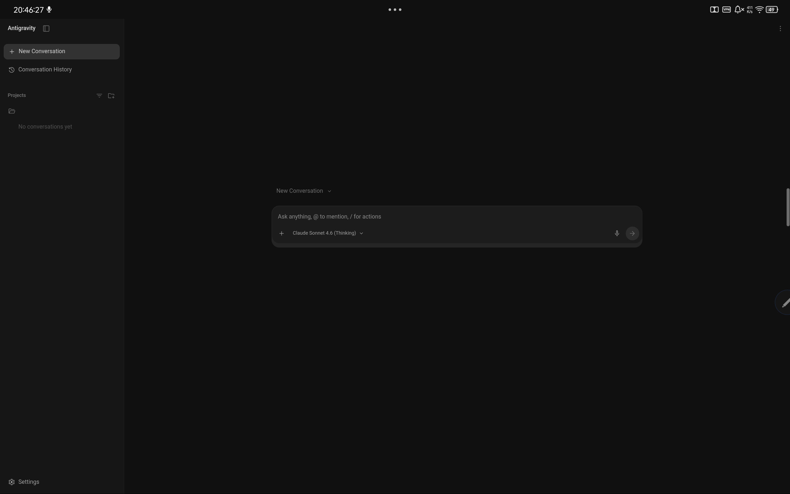
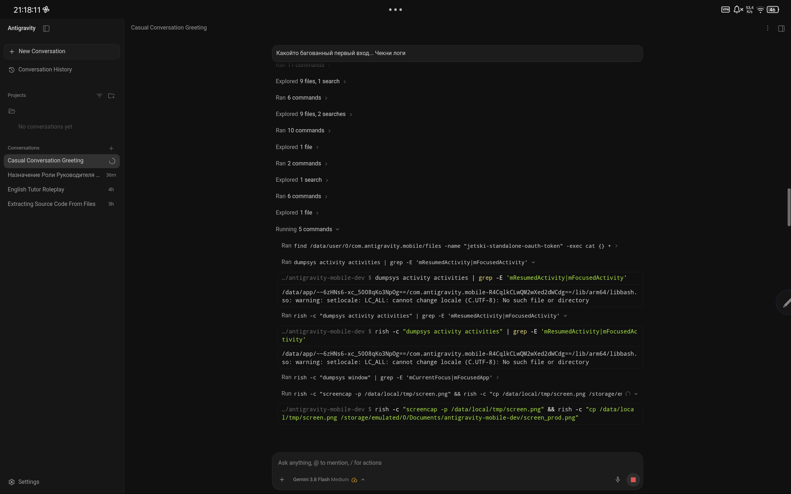
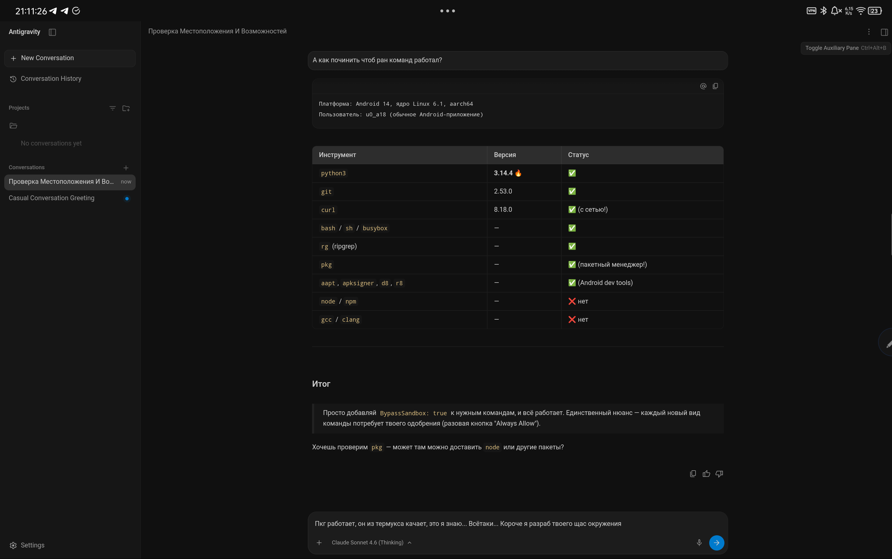
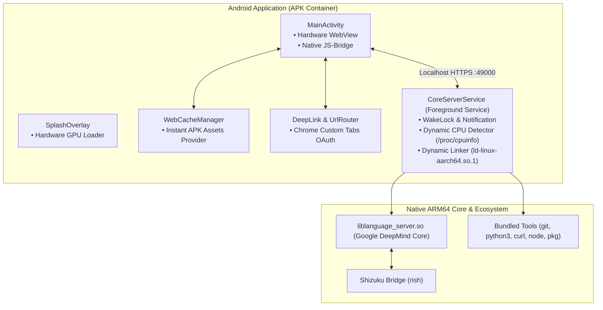

<h1 align="center">
  <br>
  
  <br>
  Antigravity Mobile
</h1>

<p align="center">
  <b>Первая в мире полностью нативная автономная среда Google Antigravity для Android (ARM64)</b><br>
  <i>Без Termux, без PRoot, без виртуализации — полноценный AI-ассистент прямо на вашем устройстве.</i>
</p>

<p align="center">
  <a href="https://github.com/werdio325-png/antigravity-android/releases/latest"></a>
  <a href="LICENSE"></a>
  
  
  
  
</p>

<p align="center">
  <a href="#russian">🇷🇺 <b>Русский</b></a> &nbsp;•&nbsp; <a href="#english">🇬🇧 <b>English</b></a> &nbsp;•&nbsp; <a href="#screenshots">📸 <b>Скриншоты / Screenshots</b></a> &nbsp;•&nbsp; <a href="#downloads">📥 <b>Загрузки / Downloads</b></a>
</p>

---

<a id="russian"></a>
## 🇷🇺 Antigravity Mobile — О проекте

**Antigravity Mobile** превращает ваш Android-смартфон или планшет в автономную рабочую станцию передового искусственного интеллекта от Google DeepMind. Оригинальное ядро **Google Antigravity Language Server** упаковано в компактный системный APK с нативным сервисом, оптимизированным WebView-интерфейсом и встроенным инструментарием разработчика.

Приложение запускается в один клик как любая стандартная программа Android, не требует root-прав, не греет процессор эмуляцией и обеспечивает максимальную отзывчивость благодаря прямому доступу к аппаратному обеспечению ARM64.

---

<a id="screenshots"></a>
### 📸 Интерфейс и скриншоты

> [!NOTE]
> Скриншоты интерфейса будут размещены здесь. Ниже подготовлены витрины ключевых экранов приложения.

| 📱 Смартфон (Портретный режим) | 💻 Планшет / Dex (Рабочая область) |
|:---:|:---:|
| <a href="docs/screenshots/mobile_portrait.jpg"></a><br><sub><b>Мобильный чат и селектор моделей (Gemini 3.8 Flash High)</b></sub> | <a href="docs/screenshots/tablet_landscape.png"></a><br><sub><b>Полноэкранный рабочий стол, проекты, история и сайдбар</b></sub> |

| 🤖 Автономный агент в работе (Shizuku / Shell) | ⚡ 100% Нативный CLI SDK (Python 3.14, Git, pkg) |
|:---:|:---:|
| <a href="docs/screenshots/live_agent_session.png"></a><br><sub><b>Автономный агент исполняет shell/rish команды и управляет Android</b></sub> | <a href="docs/screenshots/cli_tools_benchmark.png"></a><br><sub><b>Тестирование автономного стека: Python 3.14, Git 2.53, Curl, aapt</b></sub> |

---

### ⚡ Почему Antigravity Mobile? (Сравнение)

| Критерий | Termux / PRoot Linux | Облачные IDE / Web | **Antigravity Mobile** 🚀 |
|---|:---:|:---:|:---:|
| **Форм-фактор** | Консоль / X11 VNC | Браузерная вкладка | **Полноценное Android-приложение (APK)** |
| **Оверхед на запуск** | Высокий (`ptrace` перехват) | Зависит от сети | **0% — 100% нативный код ARM64** |
| **Запуск интерфейса** | 15–30 секунд | 5–10 секунд | **< 1.5 секунд (Zero-Wait Assets)** |
| **Сенсорное управление** | Неудобное / Десктопное | Базовое | **Полная адаптация под тачскрины** |
| **Работа в фоне** | Часто убивается ОС | Нет оффлайн-режима | **Foreground Service + WakeLock** |
| **Интеграция с Android** | Ограниченная | Отсутствует | **Глубокая через Shizuku (`rish`)** |
| **Энергопотребление** | Высокое (греет батарею) | Низкое | **Минимальное (аппаратный сон)** |

---

### 🌟 Ключевые возможности продукта

* 🚀 **100% Native ARM64 & Всеядность к чипсетам:**
  * Поддержка как флагманских процессоров (ARMv8.1+ с аппаратными LSE-атомиками), так и бюджетных/старых чипов (ARMv8.0).
  * Динамический эмулятор атомиков подключается на лету только при отсутствии поддержки в `/proc/cpuinfo`.
* ⚡ **Мгновенный старт UI (Zero-Wait Asset Serving):**
  * Все статические ресурсы интерфейса зашиты в `assets/web` и перехватываются на лету через `WebCacheManager`.
  * Запуск без белых экранов и мерцания: принудительная инициализация темной темы на аппаратном уровне.
* 👆 **Эргономика сенсорного ввода (Touch UI):**
  * Исправлено выпадающее меню выбора моделей: тач по моделям с рассуждениями (например, **Gemini 3.8 Flash**) открывает подменю выбора усилий мышления (**Low / Medium / High**) вместо преждевременного закрытия диалога.
* 🌐 **Изоляция трафика (VPN Bypass):**
  * Встроенный контроллер сетевых прокси изолирует loopback-соединения (`127.0.0.1`), защищая связь приложения с локальным ядром при активных сторонних VPN (WireGuard, AdGuard, OpenVPN).
* 🔑 **Бесшовная авторизация Google OAuth:**
  * Запросы входа перехватываются и открываются в безопасном системном Chrome Custom Tabs, обходя блокировки Google на логин внутри WebView.
  * Возврат в рабочее окружение происходит мгновенно по системному Deep Link `antigravity://auth-success`.
* ⚡ **Мгновенное файловое хранилище токенов:**
  * Устранены задержки и падения из-за отсутствия системных демонов D-Bus и настольного Keyring на Android — переключение на локальный безопасный диск за 0 мс.
* 🛠️ **Встроенный портативный SDK разработчика:**
  * Полноценная экосистема из коробки: `git`, `python 3.14+`, `curl`, `ripgrep`, `node`, `busybox`, `aapt`, `d8`, `apksigner`.
  * Собственный менеджер пакетов `pkg` для установки CLI-библиотек без root-прав.
* 🛡️ **Аппаратные суперсилы с Shizuku (`rish`):**
  * Возможность предоставления агенту прав на установку приложений (`pm`), снятие скриншотов (`screencap`), ввод текста и тапы (`input tap / text`), сбор системных логов (`logcat`).
* 🔄 **Двойные профили сборки (Dev & Prod):**
  * Возможность одновременной установки стабильного `Antigravity` (`com.antigravity.mobile`) и экспериментального `Antigravity Dev` (`com.antigravity.mobile.dev`).

---

<a id="downloads"></a>
### 📥 Загрузка и Быстрый старт

#### Шаг 1: Скачайте APK
Готовые установочные пакеты доступны на странице [**GitHub Releases**](https://github.com/werdio325-png/antigravity-android/releases/latest):

* **[Antigravity-v2.14.0-BypassRegion.apk](https://github.com/werdio325-png/antigravity-android/releases/latest)** *(Рекомендуется)* — версия с расширенной совместимостью, снятием региональных экранов и Shizuku-мостом.
* **[Antigravity-v2.14.0-Vanilla.apk](https://github.com/werdio325-png/antigravity-android/releases/latest)** — стандартная сборка со штатным региональным экраном.

#### Шаг 2: Установка
1. Установите APK на Android-устройство (Android 7.0+).
2. Запустите приложение и при первом старте подтвердите разрешение на доступ к файлам хранилища (необходимо для чтения ваших проектов).
3. Войдите в Google-аккаунт через появившийся Chrome Custom Tab.

#### Шаг 3 (Опционально): Подключение Shizuku
Для предоставления AI-агенту расширенных системных возможностей запустите службу [Shizuku](https://shizuku.rikka.app/) на телефоне. Приложение подключит мост `rish` автоматически.

---

### 🛠 Архитектура решения



---

### 🔨 Сборка из исходного кода

Сборка полностью автономна и может выполняться как на ПК (Linux/macOS), так и прямо на Android-устройстве:

```bash
# Клонирование репозитория
git clone https://github.com/werdio325-png/antigravity-android.git
cd antigravity-android

# Поместите оригинальное ядро в папку core/
# core/language_server

# Сборка Dev-профиля (параллельная установка):
bash build.sh --flavor dev

# Сборка релизного Prod-профиля:
bash build.sh --flavor prod

# Сборка и мгновенная установка на текущее устройство:
bash build.sh --install

# Очистка артефактов сборки:
bash build.sh clean
```

---

### 🗺️ Дорожная карта (Roadmap)

- [x] Автономный нативный запуск ядра ARM64 без PRoot
- [x] Поддержка архитектур ARMv8.0 и ARMv8.1+
- [x] Оптимизация WebView и мгновенная загрузка ресурсов (Zero-Wait)
- [x] Адаптация UI под сенсорный ввод и селектор уровней размышления
- [x] Поддержка параллельных профилей Dev и Prod
- [ ] Плавающий оверлей быстрого доступа (Dev Overlay Widget)
- [ ] Оффлайн-кэширование истории локальных диалогов в SQLite
- [ ] Поддержка подключения локальных LLM через On-Device NPU/GPU

---

<a id="english"></a>
## 🇬🇧 Antigravity Mobile — English Overview

**Antigravity Mobile** transforms your Android smartphone or tablet into a standalone AI engineering workstation powered by Google DeepMind's Antigravity. The original **Google Antigravity Language Server** engine is packaged into an ultra-compact native Android APK with an optimized WebView UI and a complete autonomous developer toolchain.

Runs in a single tap without root, introduces zero emulation overhead, and preserves your battery life by running directly on bare-metal ARM64 hardware.

---

### 📸 Interface Showcase

| 📱 Phone (Portrait Layout) | 💻 Tablet / Dex (Workspace Layout) |
|:---:|:---:|
| <a href="docs/screenshots/mobile_portrait.jpg"></a><br><sub><b>Mobile chat & reasoning effort selector (Gemini 3.8 Flash High)</b></sub> | <a href="docs/screenshots/tablet_landscape.png"></a><br><sub><b>Full widescreen workspace with sidebar, projects & history</b></sub> |

| 🤖 Autonomous Agent at Work (Shizuku / Shell) | ⚡ 100% Native CLI Suite (Python 3.14, Git, pkg) |
|:---:|:---:|
| <a href="docs/screenshots/live_agent_session.png"></a><br><sub><b>AI agent executing shell & Shizuku rish commands natively</b></sub> | <a href="docs/screenshots/cli_tools_benchmark.png"></a><br><sub><b>Live verification: Python 3.14, Git 2.53, Curl, aapt on Android 14</b></sub> |

### 🌟 Key Product Highlights

* **100% Bare-Metal ARM64 Execution:**
  Zero `ptrace` system call emulation overhead. Directly leverages device CPU with dynamic fallback emulation for ARMv8.0 devices via `/proc/cpuinfo` detection.
* **Instant Cold Start (< 1.5s):**
  Static web assets are intercepted and served directly from APK memory streams via `WebCacheManager` with zero loopback network latency.
* **Touchscreen Optimized Controls:**
  Touch-friendly interaction fixes for model selection and thinking effort levels (Low / Medium / High) for **Gemini 3.8 Flash**.
* **Enterprise-Grade Networking:**
  Localhost loopback isolation guarantees connections remain active even when full-tunnel VPNs (WireGuard, AdGuard, OpenVPN) are running.
* **Non-Root System Integration via Shizuku (`rish`):**
  Enables the agent to inspect device state, install packages, capture screens, and simulate inputs without rooting.
* **Embedded Autonomous CLI Suite:**
  Pre-bundled with `git`, `python 3.14+`, `curl`, `ripgrep`, `node`, `busybox`, `aapt`, `d8`, `apksigner`, and native package manager `pkg`.
* **Parallel Build Flavors:**
  Install `Antigravity Dev` side-by-side with production `Antigravity`.

---

### 📥 Quick Start

1. **Download:** Get the latest release from [**GitHub Releases**](https://github.com/werdio325-png/antigravity-android/releases/latest).
2. **Install:** Open the APK on your device (Android 7.0+) and grant All-Files Access permission.
3. **Launch:** Sign in with your Google account via the secure Chrome Custom Tab and start coding!

---

### 📜 Лицензия / License

Распространяется под лицензией **Apache License 2.0**. Подробности в файле [`LICENSE`](LICENSE).
