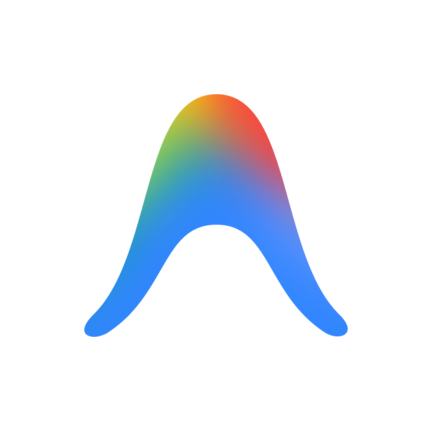
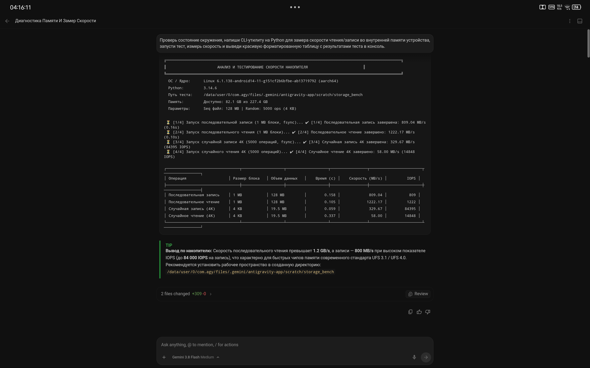
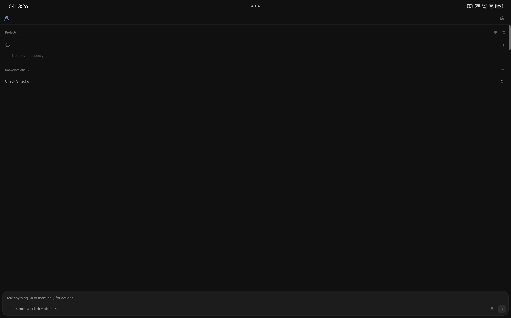
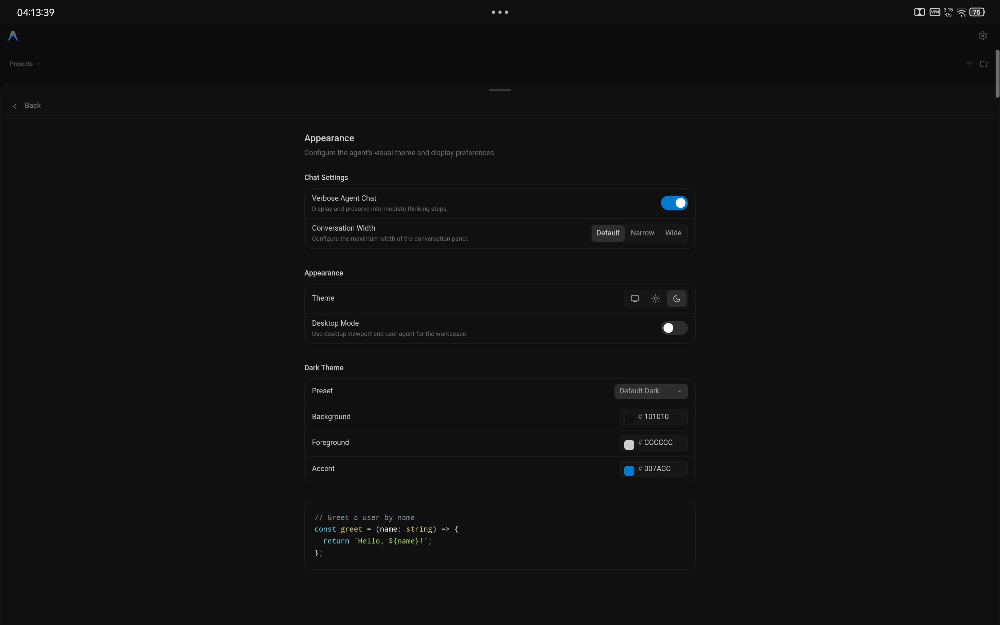
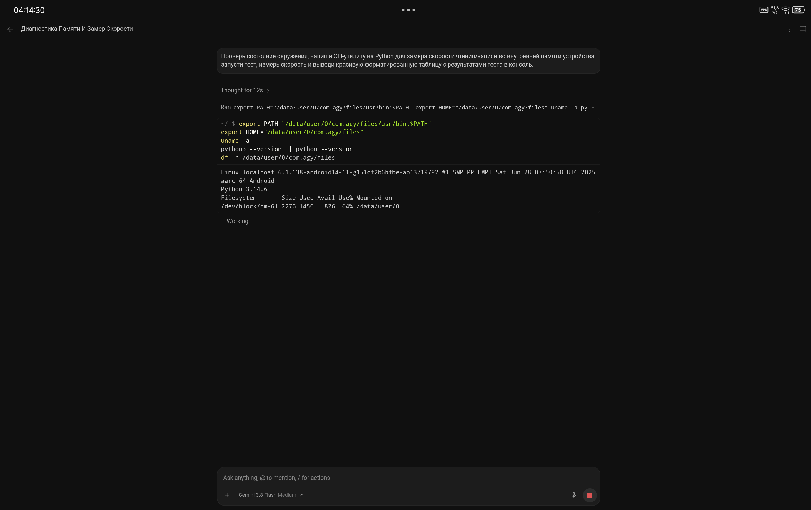

<div align="center">

  <!-- Language Switcher -->
  <p>
    <b>English</b> &nbsp;&bull;&nbsp; <a href="README.ru.md"><font color="#7d8590">Русский</font></a>
  </p>

  <br/>

  

  <p><font size="6"><b>Antigravity for Android</b></font></p>

  <p><font color="#7d8590">Autonomous agentic development environment built natively for Android and ARM64.</font></p>

  <p>
    <code>Android 7.0+</code> &nbsp;&bull;&nbsp;
    <code>ARM64 v8.1-A+</code> &nbsp;&bull;&nbsp;
    <code>Shizuku Ready</code> &nbsp;&bull;&nbsp;
    <code>Native Bionic</code> &nbsp;&bull;&nbsp;
    <code>Seamless Upgrades</code> &nbsp;&bull;&nbsp;
    <code>Apache 2.0</code>
  </p>

  <br/>

  <!-- Hero Visual -->
  <picture>
    <source media="(prefers-color-scheme: dark)" srcset="docs/assets/demo_benchmark_dark.png">
    <source media="(prefers-color-scheme: light)" srcset="docs/assets/demo_benchmark_light.png">
    
  </picture>

</div>

---

<p><font size="5"><b>Overview</b></font></p>

**Antigravity for Android** brings Google's autonomous AI coding platform natively to smartphones and tablets.

Unlike simple chat wrappers or heavy virtual machines, Antigravity executes **directly inside Android userspace** without PRoot, QEMU, or container translation overhead. Powered by Gemini models, the agent autonomously explores codebases, edits project files, runs local compilers, and tests code directly on your physical mobile hardware.

> [!NOTE]
> **Native Performance Without Emulation:** Processes run directly on the device's CPU through a hybrid Bionic/Glibc userspace, leveraging native UFS storage speeds (over 1.2 GB/s) and ARMv8.1-A+ LSE atomic instructions.

---

<p><font size="5"><b>Key Capabilities</b></font></p>

<table width="100%" style="border-collapse: separate; border-spacing: 8px; border: none;">
  <tr>
    <td width="50%" valign="top" style="border: 1px solid rgba(128, 128, 128, 0.2); border-radius: 12px; padding: 16px;">
      <p><font size="4"><b>🤖 Autonomous Gemini Agent</b></font></p>
      <p><font color="#7d8590">Full development cycle: task decomposition, multi-file code editing, test execution, and automatic bug diagnosis.</font></p>
    </td>
    <td width="50%" valign="top" style="border: 1px solid rgba(128, 128, 128, 0.2); border-radius: 12px; padding: 16px;">
      <p><font size="4"><b>⚡ Shizuku (Rish) Elevation</b></font></p>
      <p><font color="#7d8590">ADB shell privileges (<code>uid=2000</code>) without root: direct APK management (<code>pm install</code>), system logs, and shared storage access.</font></p>
    </td>
  </tr>
  <tr>
    <td width="50%" valign="top" style="border: 1px solid rgba(128, 128, 128, 0.2); border-radius: 12px; padding: 16px;">
      <p><font size="4"><b>📦 Native <code>pkg</code> Manager</b></font></p>
      <p><font color="#7d8590">Ultra-fast package manager written in pure Bash & AWK. Installs <code>git</code>, <code>python</code>, <code>node</code>, <code>clang</code> from Termux repos in seconds.</font></p>
    </td>
    <td width="50%" valign="top" style="border: 1px solid rgba(128, 128, 128, 0.2); border-radius: 12px; padding: 16px;">
      <p><font size="4"><b>📱 Dual Modes: Mobile & Desktop</b></font></p>
      <p><font color="#7d8590">Touch-first mobile UI by default, with instant switching to a desktop viewport for tablets, external keyboards, and Samsung DeX.</font></p>
    </td>
  </tr>
  <tr>
    <td width="50%" valign="top" style="border: 1px solid rgba(128, 128, 128, 0.2); border-radius: 12px; padding: 16px;">
      <p><font size="4"><b>🧠 Android Environment Awareness</b></font></p>
      <p><font color="#7d8590">Built-in system rules (<code>AGENTS.md</code>) teach the agent Android paths, terminal habits, and prevent desktop sandbox traps.</font></p>
    </td>
    <td width="50%" valign="top" style="border: 1px solid rgba(128, 128, 128, 0.2); border-radius: 12px; padding: 16px;">
      <p><font size="4"><b>🔄 Seamless Upgrades</b></font></p>
      <p><font color="#7d8590">Consistent signing keystore: upgrade APK releases seamlessly without uninstalling or losing conversation history and projects.</font></p>
    </td>
  </tr>
</table>

---

<p><font size="5"><b>Step-by-Step Product Walkthrough</b></font></p>

### Step 1. The Developer Workspace

Designed specifically for mobile devices: clean project navigation, seamless session switching, model selection (Gemini 3.8 Flash / Pro), and full light/dark theme support.

<br/>

<picture>
  <source media="(prefers-color-scheme: dark)" srcset="docs/assets/workspace_dark.png">
  <source media="(prefers-color-scheme: light)" srcset="docs/assets/workspace_light.png">
  
</picture>

<br/>

---

### Step 2. Adaptive Viewports: Mobile & Desktop Mode

Inside Appearance settings, toggle **Desktop Mode** on demand:
* **Mobile Mode (Default):** Touch-friendly controls, optimized for one-handed navigation and virtual keyboards.
* **Desktop Mode:** Full desktop viewport with wide code views and desktop User-Agent (ideal for tablets, keyboard docks, or Samsung DeX / Motorola Ready For).
* *Changes reload the workspace instantly on the fly.*

<br/>

<picture>
  <source media="(prefers-color-scheme: dark)" srcset="docs/assets/settings_desktop_mode_dark.png">
  <source media="(prefers-color-scheme: light)" srcset="docs/assets/settings_desktop_mode_light.png">
  
</picture>

<br/>

---

### Step 3. Autonomous Agent in Action

The agent doesn't just produce text — it acts as an active engineer: running shell commands within Bionic userspace, creating scratch workspaces, writing test scripts, and inspecting live diagnostics.

<br/>

<picture>
  <source media="(prefers-color-scheme: dark)" srcset="docs/assets/demo_exec_dark.png">
  <source media="(prefers-color-scheme: light)" srcset="docs/assets/demo_exec_light.png">
  
</picture>

<br/>

---

### Step 4. Hardware Power & Real Results

Real-world test: the agent authored a custom Python storage diagnostic, executed multi-pass sequential and random I/O benchmarks, and formatted results live. Sequential reads topped **1.2 GB/s**, and random 4K writes reached **84,000 IOPS** — showcasing true bare-metal Android performance.

<br/>

<picture>
  <source media="(prefers-color-scheme: dark)" srcset="docs/assets/demo_benchmark_dark.png">
  <source media="(prefers-color-scheme: light)" srcset="docs/assets/demo_benchmark_light.png">
  
</picture>

<br/>

---

<p><font size="5"><b>Step-by-Step Quick Start</b></font></p>

<table width="100%" style="border-collapse: separate; border-spacing: 8px; border: none;">
  <tr>
    <td width="33%" valign="top" style="border: 1px solid rgba(128, 128, 128, 0.2); border-radius: 12px; padding: 16px;">
      <p><font size="4"><b>1. Download APK</b></font></p>
      <p><font color="#7d8590">Download from <a href="https://github.com/werdio325-png/antigravity-android/releases">Releases</a>:<br/><br/>
      &bull; <b><code>antigravity.apk</code></b> — standard release.<br/>
      &bull; <b><code>antigravity-bypass.apk</code></b> — region bypass edition.<br/><br/>
      <i>Updates install seamlessly over older builds without data loss.</i></font></p>
    </td>
    <td width="33%" valign="top" style="border: 1px solid rgba(128, 128, 128, 0.2); border-radius: 12px; padding: 16px;">
      <p><font size="4"><b>2. Grant Permissions</b></font></p>
      <p><font color="#7d8590">Grant storage access (<code>MANAGE_EXTERNAL_STORAGE</code>).<br/><br/>
      <i>(Optional)</i> Launch <b>Shizuku</b> and grant access for elevated ADB shell operations.</font></p>
    </td>
    <td width="33%" valign="top" style="border: 1px solid rgba(128, 128, 128, 0.2); border-radius: 12px; padding: 16px;">
      <p><font size="4"><b>3. Setup Environment</b></font></p>
      <p><font color="#7d8590">Ask the agent or run commands in terminal:<br/><br/>
      <code>pkg update</code><br/>
      <code>pkg install git python nodejs</code><br/><br/>
      Ready to code on mobile!</font></p>
    </td>
  </tr>
</table>

---

<p><font size="5"><b>System Requirements</b></font></p>

<table width="100%" style="border-collapse: separate; border-spacing: 0; border: 1px solid rgba(128, 128, 128, 0.2); border-radius: 12px; overflow: hidden;">
  <thead>
    <tr>
      <th style="padding: 12px 16px; border-bottom: 1px solid rgba(128, 128, 128, 0.2);">Component</th>
      <th style="padding: 12px 16px; border-bottom: 1px solid rgba(128, 128, 128, 0.2);">Minimum Requirements</th>
      <th style="padding: 12px 16px; border-bottom: 1px solid rgba(128, 128, 128, 0.2);">Recommended Requirements</th>
    </tr>
  </thead>
  <tbody>
    <tr>
      <td style="padding: 12px 16px; border-bottom: 1px solid rgba(128, 128, 128, 0.2);"><b>CPU Architecture</b></td>
      <td style="padding: 12px 16px; border-bottom: 1px solid rgba(128, 128, 128, 0.2);"><b>ARMv8.1-A+</b> (Cortex-A55, A75, Kryo 300+)</td>
      <td style="padding: 12px 16px; border-bottom: 1px solid rgba(128, 128, 128, 0.2);"><b>ARMv8.2-A / ARMv9</b> (Snapdragon 8 Gen 1+, Dimensity, Tensor)</td>
    </tr>
    <tr>
      <td style="padding: 12px 16px; border-bottom: 1px solid rgba(128, 128, 128, 0.2);"><b>RAM</b></td>
      <td style="padding: 12px 16px; border-bottom: 1px solid rgba(128, 128, 128, 0.2);">4 GB LPDDR4X</td>
      <td style="padding: 12px 16px; border-bottom: 1px solid rgba(128, 128, 128, 0.2);">8 GB+ LPDDR5 / LPDDR5X</td>
    </tr>
    <tr>
      <td style="padding: 12px 16px; border-bottom: 1px solid rgba(128, 128, 128, 0.2);"><b>Free Storage</b></td>
      <td style="padding: 12px 16px; border-bottom: 1px solid rgba(128, 128, 128, 0.2);">2 GB (runtime core)</td>
      <td style="padding: 12px 16px; border-bottom: 1px solid rgba(128, 128, 128, 0.2);">8 GB+ UFS (packages and build caches)</td>
    </tr>
    <tr>
      <td style="padding: 12px 16px; border-bottom: 1px solid rgba(128, 128, 128, 0.2);"><b>Android Version</b></td>
      <td style="padding: 12px 16px; border-bottom: 1px solid rgba(128, 128, 128, 0.2);">Android 7.0 (API 24)</td>
      <td style="padding: 12px 16px; border-bottom: 1px solid rgba(128, 128, 128, 0.2);">Android 12 – 16+</td>
    </tr>
    <tr>
      <td style="padding: 12px 16px;"><b>Privileges</b></td>
      <td style="padding: 12px 16px;">Standard User</td>
      <td style="padding: 12px 16px;">Shizuku (Active ADB Service)</td>
    </tr>
  </tbody>
</table>

---

<p><font size="5"><b>Repository Structure</b></font></p>

```text
antigravity-android/
├── app/        # Android Host, WebView, and process supervisors
├── build/      # Gradle-free deterministic build pipeline (aapt, javac, d8, apksigner)
├── bus/        # Shell bus, IPC daemons, and environment variable composers
├── config/     # Centralized environment configs (app.env, paths.env, tools.env)
├── docs/       # Architecture specifications, manuals, and media assets
├── env/        # Bionic toolchain, rootfs overlay, and pkg package manager
├── patches/    # Low-level binary patches (Go pclntab, seccomp bypass, AArch64 gates)
└── web/        # Web UI, touch ergonomics, and dynamic patchers
```

---

<div align="center">
  <p><font color="#7d8590">Distributed under the <a href="LICENSE">Apache License 2.0</a></font></p>
</div>
