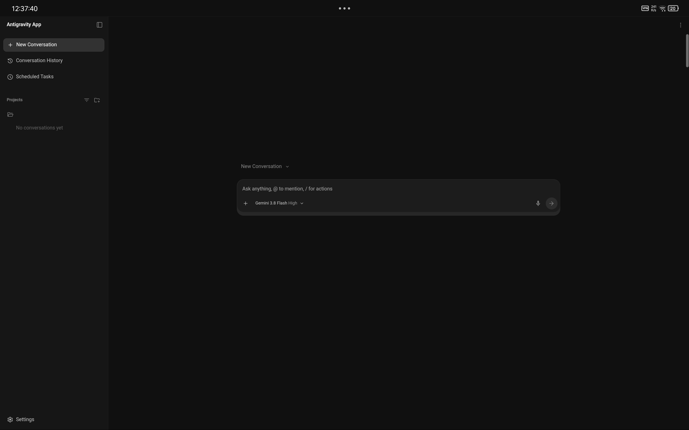

<div align="center">

  <!-- Language Switcher -->
  <p>
    <b>English</b> &nbsp;&bull;&nbsp; <a href="README.ru.md"><font color="#7d8590">Русский</font></a>
  </p>

  <br/>

  

  <p><font size="6"><b>Antigravity for Android</b></font></p>

  <p><font color="#7d8590">Autonomous agentic development environment engineered natively for Android and ARM64.</font></p>

  <p>
    <code>Android 7.0+</code> &nbsp;&bull;&nbsp;
    <code>ARM64 v8.1-A+</code> &nbsp;&bull;&nbsp;
    <code>Shizuku Ready</code> &nbsp;&bull;&nbsp;
    <code>Native Bionic</code> &nbsp;&bull;&nbsp;
    <code>Consistent Keystore</code> &nbsp;&bull;&nbsp;
    <code>Apache 2.0</code>
  </p>

  <br/>

  <!-- Hero Visual -->
  <picture>
    <source media="(prefers-color-scheme: dark)" srcset="docs/assets/hero_dark.png">
    <source media="(prefers-color-scheme: light)" srcset="docs/assets/hero_light.png">
    
  </picture>
  <p align="center"><font size="2" color="#7d8590">Antigravity autonomous agent development interface on Android (Linux 6.1, AArch64)</font></p>

</div>

---

<p><font size="5"><b>Architectural Overview</b></font></p>

**Antigravity for Android** brings Google's autonomous agentic coding engine directly to mobile operating systems.

Unlike terminal-based chat wrappers or virtualized environments (PRoot, QEMU, chroot), Antigravity executes **natively inside Android userspace (Bionic)** within the application process. Powered by Gemini models, the agent autonomously inspects codebases, edits project trees, executes build tools, and validates results directly on the physical mobile hardware.

> [!NOTE]
> **Bare-Metal Execution Without Emulation:** Processes run directly on the host CPU via a hybrid Bionic/Glibc loader without virtualization penalties, taking full advantage of UFS storage throughput and ARMv8.1-A+ Large System Extension (LSE) atomics.

---

<p><font size="5"><b>Key Capabilities</b></font></p>

<table width="100%" style="border-collapse: separate; border-spacing: 8px; border: none;">
  <tr>
    <td width="50%" valign="top" style="border: 1px solid rgba(128, 128, 128, 0.2); border-radius: 12px; padding: 16px;">
      <p><font size="4"><b>Autonomous Gemini Agent</b></font></p>
      <p><font color="#7d8590">End-to-end development: task planning, multi-file editing, test execution, compilation, and automatic build diagnosis.</font></p>
    </td>
    <td width="50%" valign="top" style="border: 1px solid rgba(128, 128, 128, 0.2); border-radius: 12px; padding: 16px;">
      <p><font size="4"><b>Shizuku (Rish) Elevation</b></font></p>
      <p><font color="#7d8590">Privilege elevation to ADB shell level (<code>uid=2000</code>) without root: direct APK management (<code>pm install</code>), system logs, and shared storage access.</font></p>
    </td>
  </tr>
  <tr>
    <td width="50%" valign="top" style="border: 1px solid rgba(128, 128, 128, 0.2); border-radius: 12px; padding: 16px;">
      <p><font size="4"><b>Native <code>pkg</code> Manager</b></font></p>
      <p><font color="#7d8590">Lightweight package manager (tlx) written in Bash and AWK. Installs development runtimes (<code>git</code>, <code>python</code>, <code>node</code>, <code>clang</code>) from Termux repositories.</font></p>
    </td>
    <td width="50%" valign="top" style="border: 1px solid rgba(128, 128, 128, 0.2); border-radius: 12px; padding: 16px;">
      <p><font size="4"><b>Mobile & Desktop Viewports</b></font></p>
      <p><font color="#7d8590">Touch-first mobile UI by default, with dynamic switching to a desktop viewport with custom User-Agent for tablets, keyboards, and Samsung DeX.</font></p>
    </td>
  </tr>
  <tr>
    <td width="50%" valign="top" style="border: 1px solid rgba(128, 128, 128, 0.2); border-radius: 12px; padding: 16px;">
      <p><font size="4"><b>Environment Awareness</b></font></p>
      <p><font color="#7d8590">Auto-seeded system rules (<code>AGENTS.md</code>) instruct the agent on Android filesystem paths, package syntax, and prevent desktop sandbox traps.</font></p>
    </td>
    <td width="50%" valign="top" style="border: 1px solid rgba(128, 128, 128, 0.2); border-radius: 12px; padding: 16px;">
      <p><font size="4"><b>Seamless Upgrades</b></font></p>
      <p><font color="#7d8590">Consistent signing keystore: upgrade APK releases in-place without uninstalling or losing conversation history and project data.</font></p>
    </td>
  </tr>
</table>

---

<p><font size="5"><b>Visual Feature Walkthrough</b></font></p>

### 1. Developer Workspace

Designed specifically for mobile screens: project sidebar, session switching, Gemini model selector, and system theme synchronization.

<br/>

<picture>
  <source media="(prefers-color-scheme: dark)" srcset="docs/assets/workspace_dark.png">
  <source media="(prefers-color-scheme: light)" srcset="docs/assets/workspace_light.png">
  
</picture>
<p align="center"><font size="2" color="#7d8590">Sidebar navigation and active workspace canvas (dark and light themes)</font></p>

<br/>

---

### 2. Viewport Control: Mobile & Desktop Mode

Inside Appearance settings, toggle **Desktop Mode** on demand:
* **Mobile Mode (Default):** Touch-friendly controls optimized for one-handed operation and virtual keyboards.
* **Desktop Mode:** Full desktop viewport with wide editor layout and desktop User-Agent (for tablets, physical keyboards, and Samsung DeX).
* *Changes apply dynamically on the fly via automatic WebView reload.*

<br/>

<picture>
  <source media="(prefers-color-scheme: dark)" srcset="docs/assets/settings_desktop_mode_dark.png">
  <source media="(prefers-color-scheme: light)" srcset="docs/assets/settings_desktop_mode_light.png">
  
</picture>
<p align="center"><font size="2" color="#7d8590">Appearance preferences panel with integrated Desktop Mode toggle</font></p>

<br/>

---

### 3. Autonomous Execution in Terminal

The agent directly drives the environment: executing userspace binaries, creating workspace hierarchies, running compilation tasks, and inspecting diagnostics in real time.

<br/>

<picture>
  <source media="(prefers-color-scheme: dark)" srcset="docs/assets/demo_exec_dark.png">
  <source media="(prefers-color-scheme: light)" srcset="docs/assets/demo_exec_light.png">
  
</picture>
<p align="center"><font size="2" color="#7d8590">Agent provisioning project structure and probing Linux 6.1 kernel parameters</font></p>

<br/>

---

### 4. Hardware Throughput & Diagnostics

Real-world test: the agent authored a custom Python I/O benchmark and executed multi-pass tests on physical storage. Sequential reads exceeded **1222 MB/s**, and random writes reached **84,395 IOPS**, proving native UFS throughput without emulation overhead.

<br/>

<picture>
  <source media="(prefers-color-scheme: dark)" srcset="docs/assets/demo_benchmark_dark.png">
  <source media="(prefers-color-scheme: light)" srcset="docs/assets/demo_benchmark_light.png">
  
</picture>
<p align="center"><font size="2" color="#7d8590">Formatted diagnostic report with tabular performance breakdown</font></p>

<br/>

---

<p><font size="5"><b>Installation & Getting Started</b></font></p>

<table width="100%" style="border-collapse: separate; border-spacing: 8px; border: none;">
  <tr>
    <td width="33%" valign="top" style="border: 1px solid rgba(128, 128, 128, 0.2); border-radius: 12px; padding: 16px;">
      <p><font size="4"><b>1. Download APK</b></font></p>
      <p><font color="#7d8590">Releases are available under <a href="https://github.com/werdio325-png/antigravity-android/releases">Releases</a>:<br/><br/>
      &bull; <b><code>antigravity.apk</code></b> — standard release (port 45157).<br/>
      &bull; <b><code>antigravity-bypass.apk</code></b> — region bypass edition.<br/><br/>
      <i>Seamless in-place updates are supported across versions.</i></font></p>
    </td>
    <td width="33%" valign="top" style="border: 1px solid rgba(128, 128, 128, 0.2); border-radius: 12px; padding: 16px;">
      <p><font size="4"><b>2. Grant Permissions</b></font></p>
      <p><font color="#7d8590">Grant storage access (<code>MANAGE_EXTERNAL_STORAGE</code>).<br/><br/>
      <i>(Optional)</i> Launch <b>Shizuku</b> and grant access for elevated ADB shell operations without root.</font></p>
    </td>
    <td width="33%" valign="top" style="border: 1px solid rgba(128, 128, 128, 0.2); border-radius: 12px; padding: 16px;">
      <p><font size="4"><b>3. Bootstrap Environment</b></font></p>
      <p><font color="#7d8590">Install preferred development toolchains via the agent or shell:<br/><br/>
      <code>pkg update</code><br/>
      <code>pkg install git python nodejs</code><br/><br/>
      The environment is ready for development.</font></p>
    </td>
  </tr>
</table>

---

<p><font size="5"><b>System Requirements</b></font></p>

<table width="100%" style="border-collapse: separate; border-spacing: 0; border: 1px solid rgba(128, 128, 128, 0.2); border-radius: 12px; overflow: hidden;">
  <thead>
    <tr>
      <th style="padding: 12px 16px; border-bottom: 1px solid rgba(128, 128, 128, 0.2);">Component</th>
      <th style="padding: 12px 16px; border-bottom: 1px solid rgba(128, 128, 128, 0.2);">Minimum Requirements</th>
      <th style="padding: 12px 16px; border-bottom: 1px solid rgba(128, 128, 128, 0.2);">Recommended Requirements</th>
    </tr>
  </thead>
  <tbody>
    <tr>
      <td style="padding: 12px 16px; border-bottom: 1px solid rgba(128, 128, 128, 0.2);"><b>CPU Architecture</b></td>
      <td style="padding: 12px 16px; border-bottom: 1px solid rgba(128, 128, 128, 0.2);"><b>ARMv8.1-A+</b> (Cortex-A55, A75, Kryo 300+)</td>
      <td style="padding: 12px 16px; border-bottom: 1px solid rgba(128, 128, 128, 0.2);"><b>ARMv8.2-A / ARMv9</b> (Snapdragon 8 Gen 1+, Dimensity, Tensor)</td>
    </tr>
    <tr>
      <td style="padding: 12px 16px; border-bottom: 1px solid rgba(128, 128, 128, 0.2);"><b>RAM</b></td>
      <td style="padding: 12px 16px; border-bottom: 1px solid rgba(128, 128, 128, 0.2);">4 GB LPDDR4X</td>
      <td style="padding: 12px 16px; border-bottom: 1px solid rgba(128, 128, 128, 0.2);">8 GB+ LPDDR5 / LPDDR5X</td>
    </tr>
    <tr>
      <td style="padding: 12px 16px; border-bottom: 1px solid rgba(128, 128, 128, 0.2);"><b>Free Storage</b></td>
      <td style="padding: 12px 16px; border-bottom: 1px solid rgba(128, 128, 128, 0.2);">2 GB (runtime core)</td>
      <td style="padding: 12px 16px; border-bottom: 1px solid rgba(128, 128, 128, 0.2);">8 GB+ UFS (packages and build caches)</td>
    </tr>
    <tr>
      <td style="padding: 12px 16px; border-bottom: 1px solid rgba(128, 128, 128, 0.2);"><b>Android Version</b></td>
      <td style="padding: 12px 16px; border-bottom: 1px solid rgba(128, 128, 128, 0.2);">Android 7.0 (API 24)</td>
      <td style="padding: 12px 16px; border-bottom: 1px solid rgba(128, 128, 128, 0.2);">Android 12 – 16+</td>
    </tr>
    <tr>
      <td style="padding: 12px 16px;"><b>Privileges</b></td>
      <td style="padding: 12px 16px;">Standard User</td>
      <td style="padding: 12px 16px;">Shizuku (Active ADB Service)</td>
    </tr>
  </tbody>
</table>

---

<p><font size="5"><b>Repository Structure</b></font></p>

```text
antigravity-android/
├── app/        # Android Host, WebView, and process supervisors
├── build/      # Gradle-free deterministic build pipeline (aapt, javac, d8, apksigner)
├── bus/        # Shell bus, IPC daemons, and environment variable composers
├── config/     # Centralized environment configs (app.env, paths.env, tools.env)
├── docs/       # Architecture specifications, manuals, and media assets
├── env/        # Bionic toolchain, rootfs overlay, and pkg package manager
├── patches/    # Low-level binary patches (Go pclntab, seccomp bypass, AArch64 gates)
└── web/        # Web UI, touch ergonomics, and dynamic patchers
```

---

<div align="center">
  <p><font color="#7d8590">Distributed under the <a href="LICENSE">Apache License 2.0</a></font></p>
</div>
