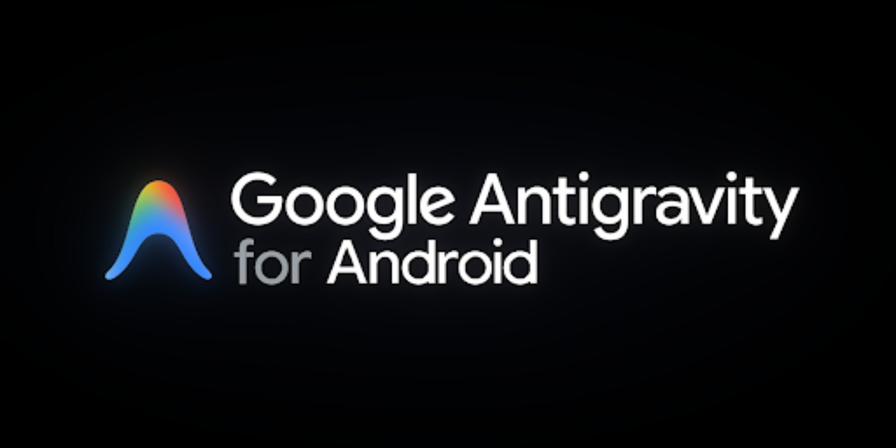

<div align="center">

  <!-- Language Switcher -->
  <p>
    <a href="README.md"><font color="#7d8590">English</font></a> &nbsp;&bull;&nbsp; <b>Русский</b>
  </p>

  <br/>

  <!-- Project Banner: Theme-Adaptive -->
  <picture>
    <source media="(prefers-color-scheme: dark)" srcset="docs/assets/banner_dark.jpg">
    <source media="(prefers-color-scheme: light)" srcset="docs/assets/banner_light.png">
    
  </picture>

  

  <p><font size="6"><b>Antigravity для Android</b></font></p>

  <p><font color="#7d8590">Автономная агентная среда разработки, созданная нативно для Android и ARM64.</font></p>

  <p>
    <code>Android 7.0+</code> &nbsp;&bull;&nbsp;
    <code>ARM64 v8.1-A+</code> &nbsp;&bull;&nbsp;
    <code>Shizuku Ready</code> &nbsp;&bull;&nbsp;
    <code>Native Bionic</code> &nbsp;&bull;&nbsp;
    <code>Apache 2.0</code>
  </p>

</div>

---

<p><font size="5"><b>Обзор</b></font></p>

**Antigravity для Android** переносит платформу автономного ИИ-программирования от Google нативно на мобильные устройства и планшеты.

В отличие от обычных чат-оболочек или тяжелых виртуальных контейнеров, Antigravity напрямую объединяет нативный изолированный Linux userspace на базе Bionic с автономным ядром агента. Агент анализирует кодовые базы, редактирует дерево проекта, запускает локальные компиляторы, выполняет тесты и проверяет работу кода прямо на физическом устройстве.

> [!NOTE]
> **Нативная производительность без контейнеров:** Выполняется напрямую в пространстве пользователя без накладных расходов PRoot, QEMU или трансляции chroot.

---

<p><font size="5"><b>Ключевые возможности</b></font></p>

<table width="100%" style="border-collapse: separate; border-spacing: 8px; border: none;">
  <tr>
    <td width="50%" valign="top" style="border: 1px solid rgba(128, 128, 128, 0.2); border-radius: 12px; padding: 16px;">
      <p><font size="4"><b>Автономный агентный движок</b></font></p>
      <p><font color="#7d8590">Прямая интеграция с моделями Gemini. Составляет планы реализации, вносит правки в проект, диагностирует ошибки сборки и координирует субагентов.</font></p>
    </td>
    <td width="50%" valign="top" style="border: 1px solid rgba(128, 128, 128, 0.2); border-radius: 12px; padding: 16px;">
      <p><font size="4"><b>Привилегии Shizuku и Rish</b></font></p>
      <p><font color="#7d8590">Повышение привилегий ADB без root (<code>uid=2000</code>). Полный доступ к общей памяти, управление пакетами (<code>pm install</code>) и системная диагностика.</font></p>
    </td>
  </tr>
  <tr>
    <td width="50%" valign="top" style="border: 1px solid rgba(128, 128, 128, 0.2); border-radius: 12px; padding: 16px;">
      <p><font size="4"><b>Встроенный менеджер пакетов</b></font></p>
      <p><font color="#7d8590">Включает <code>pkg</code> (tlx) — легковесный менеджер пакетов на чистом Bash и AWK. Быстро устанавливает инструменты разработки (<code>git</code>, <code>python</code>, <code>node</code>) за секунды.</font></p>
    </td>
    <td width="50%" valign="top" style="border: 1px solid rgba(128, 128, 128, 0.2); border-radius: 12px; padding: 16px;">
      <p><font size="4"><b>Адаптивный сенсорный интерфейс</b></font></p>
      <p><font color="#7d8590">Оптимизирован для планшетов: раздельные панели, отслеживание виртуальной клавиатуры, синхронизация цветов статус-бара и жестовое управление.</font></p>
    </td>
  </tr>
  <tr>
    <td width="50%" valign="top" style="border: 1px solid rgba(128, 128, 128, 0.2); border-radius: 12px; padding: 16px;">
      <p><font size="4"><b>Низкоуровневые патчи AArch64</b></font></p>
      <p><font color="#7d8590">Конвейер модификации бинарников для обхода ограничений seccomp ядра Android, корректировки регистров и перехвата системных вызовов libc.</font></p>
    </td>
    <td width="50%" valign="top" style="border: 1px solid rgba(128, 128, 128, 0.2); border-radius: 12px; padding: 16px;">
      <p><font size="4"><b>Детерминированная сборка без Gradle</b></font></p>
      <p><font color="#7d8590">Быстрая компиляция через прямой вызов <code>aapt</code>, <code>javac</code>, <code>d8</code> и <code>apksigner</code>. Создает подписанные релизные APK менее чем за 4 секунды.</font></p>
    </td>
  </tr>
</table>


---

<p><font size="5"><b>Системные требования</b></font></p>

> [!WARNING]
> **Ограничение процессора: требуется ARMv8.1-A или новее.**
> Ядро исполнения опирается на 64-битные атомарные инструкции Large System Extension (LSE). Старые процессоры ARMv8.0 (Cortex-A53, Cortex-A57, Cortex-A72) не поддерживаются и завершатся с ошибкой при запуске.

<table width="100%" style="border-collapse: separate; border-spacing: 0; border: 1px solid rgba(128, 128, 128, 0.2); border-radius: 12px; overflow: hidden;">
  <thead>
    <tr>
      <th style="padding: 12px 16px; border-bottom: 1px solid rgba(128, 128, 128, 0.2);">Компонент</th>
      <th style="padding: 12px 16px; border-bottom: 1px solid rgba(128, 128, 128, 0.2);">Минимальные требования</th>
      <th style="padding: 12px 16px; border-bottom: 1px solid rgba(128, 128, 128, 0.2);">Рекомендуемые требования</th>
    </tr>
  </thead>
  <tbody>
    <tr>
      <td style="padding: 12px 16px; border-bottom: 1px solid rgba(128, 128, 128, 0.2);"><b>Архитектура CPU</b></td>
      <td style="padding: 12px 16px; border-bottom: 1px solid rgba(128, 128, 128, 0.2);"><b>ARMv8.1-A+</b> (Cortex-A55, A75, Kryo 300+)</td>
      <td style="padding: 12px 16px; border-bottom: 1px solid rgba(128, 128, 128, 0.2);"><b>ARMv8.2-A / ARMv9</b> (Snapdragon 8 Gen 1+, Dimensity, Tensor)</td>
    </tr>
    <tr>
      <td style="padding: 12px 16px; border-bottom: 1px solid rgba(128, 128, 128, 0.2);"><b>Оперативная память</b></td>
      <td style="padding: 12px 16px; border-bottom: 1px solid rgba(128, 128, 128, 0.2);">4 ГБ LPDDR4X</td>
      <td style="padding: 12px 16px; border-bottom: 1px solid rgba(128, 128, 128, 0.2);">8 ГБ+ LPDDR5</td>
    </tr>
    <tr>
      <td style="padding: 12px 16px; border-bottom: 1px solid rgba(128, 128, 128, 0.2);"><b>Свободная память</b></td>
      <td style="padding: 12px 16px; border-bottom: 1px solid rgba(128, 128, 128, 0.2);">2 ГБ (ядро среды)</td>
      <td style="padding: 12px 16px; border-bottom: 1px solid rgba(128, 128, 128, 0.2);">8 ГБ+ (для компиляторов и кэша сборки)</td>
    </tr>
    <tr>
      <td style="padding: 12px 16px; border-bottom: 1px solid rgba(128, 128, 128, 0.2);"><b>Версия Android</b></td>
      <td style="padding: 12px 16px; border-bottom: 1px solid rgba(128, 128, 128, 0.2);">Android 7.0 (API 24)</td>
      <td style="padding: 12px 16px; border-bottom: 1px solid rgba(128, 128, 128, 0.2);">Android 12 – 16+</td>
    </tr>
    <tr>
      <td style="padding: 12px 16px;"><b>Привилегии</b></td>
      <td style="padding: 12px 16px;">Обычный пользователь</td>
      <td style="padding: 12px 16px;">Shizuku (Активный сервис ADB)</td>
    </tr>
  </tbody>
</table>

---

<p><font size="5"><b>Быстрый старт</b></font></p>

<p><b>1. Установка</b></p>

Доступные сборки в разделе релизов:
* `antigravity.apk` — Стандартный стабильный релиз (Порт 45157).
* `antigravity-bypass.apk` — Сборка со встроенным обходом региона (Порт 45157, включает патч региональных ограничений).

<p><b>2. Выдача разрешений</b></p>

1. Откройте приложение и предоставьте доступ ко всем файлам (`MANAGE_EXTERNAL_STORAGE`).
2. *(Опционально)* Запустите Shizuku и авторизуйте Antigravity для доступа к оболочке ADB.

<p><b>3. Проверка окружения и установка пакетов</b></p>

Проверьте целостность среды и установите базовые утилиты:

```bash
# Диагностика здоровья среды
pkg selftest

# Обновление индексов и установка инструментов
pkg update
pkg install git python nodejs bash

# Список установленных пакетов
pkg installed
```

---

<p><font size="5"><b>Структура репозитория</b></font></p>

```text
antigravity-v2/
├── app/        # Android Host, WebView и супервизор процессов
├── build/      # Детерминированная сборка без Gradle (aapt, javac, d8, apksigner)
├── bus/        # Shell-шина, демоны IPC и композиторы переменных
├── config/     # Централизованные конфиги окружения (app.env, paths.env, tools.env)
├── docs/       # Спецификации архитектуры и технические руководства
├── env/        # Тулчейн Bionic, оверлей файловой системы и pkg
├── patches/    # Патчи бинарников (Go pclntab, обход seccomp, шлюзы AArch64)
└── web/        # Веб-интерфейс, эргономика сенсорного ввода и AndroidBridge
```

---

<p><font size="5"><b>Лицензия</b></font></p>

Проект распространяется под лицензией Apache License 2.0. Условия описаны в файле LICENSE.
