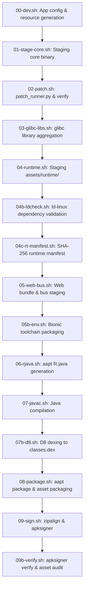

# Build & Packaging Guide: Antigravity for Android

This guide explains how to compile, patch, package, and verify **Antigravity for Android (AGY v2)** from source.

---

## 1. Prerequisites & Host Tools

The build system is entirely automated via `bash build.sh` and does not use Gradle. It requires standard Android SDK build tools, a Java JDK, and basic Linux utilities.

### Required Software
| Tool | Expected Binary | Purpose |
|---|---|---|
| **Android Asset Packaging Tool** | `aapt` (or `aapt2`) | Packaging resources, generating `R.java`, building base APK |
| **Java Compiler** | `javac` (JDK 8, 11, or 17) | Compiling Android Java sources |
| **Android D8 Dexer** | `java` + `r8.jar` | Dexing `.class` bytecode into `classes.dex` |
| **Zip Alignment Tool** | `zipalign` | 4-byte boundary alignment for Android APKs |
| **APK Signer** | `apksigner` | V2/V3 APK signature generation and verification |
| **Python** | `python3` (3.8+) | Binary patch pipeline and configuration generation |
| **Utilities** | `bash`, `zip`, `unzip`, `gzip`, `file`, `sha256sum`, `mktemp` | Archive handling and integrity verification |

### Required Vendor Inputs (`config/paths.env`)
Before building, ensure external immutable inputs are present in your vendor directory:
```bash
CORE_BIN=$AGY_HOME/core/language_server       # Pristine AArch64 language_server ELF
GLIBC_DIR=$AGY_HOME/core/glibc               # ARM64 glibc libraries (ld-linux, libc, libm...)
CERTS_DIR=$AGY_HOME/core/certs               # CA certificates
SEED_DIR=$AGY_HOME/core/seed                 # Pre-configured onboarding state pbtxt files
ANDROID_JAR=$AGY_HOME/tools/android.jar      # Android SDK android.jar (API 28+)
R8_JAR=$AGY_HOME/tools/r8.jar                # D8 dex compiler jar
KEYSTORE=$AGY_HOME/tools/debug.keystore      # Signing keystore
```

---

## 2. Build Modes & Commands

All builds are driven through `build.sh`:

```bash
# 1. Standard Release (com.agy, Port 45157 -> dist/antigravity.apk)
bash build.sh

# 2. Release with Region Bypass (dist/antigravity-bypass.apk)
bash build.sh --region-bypass

# 3. Developer Edition (com.agy.dev, Port 45158 -> dist/antigravity-dev.apk)
bash build.sh --dev

# 4. Dry-Run Mode (Runs binary patching and verification only, skips packaging)
bash build.sh --dry-run

# 5. Debug / Vanilla Core (Skips patch_runner, packages unpatched core)
bash build.sh --no-patch
```

---

## 3. Build Pipeline Phases (`build/phases/`)

The build orchestrator executes the following phases in strictly sequential order:



### Key Phase Highlights
- **`00-dev.sh`**: Runs `build/tools/gen_android_config.py` on `config/app.env`, emitting `build/gen/com/agy/BuildConfig.java` and `build/gen/res/values/gen.xml`.
- **`04b-ldcheck.sh`**: Runs a test execution of the dynamic linker (`ld-linux-aarch64.so.1 --list liblanguage_server.so`). If any shared library dependency (`NEEDED`) is missing, the build terminates fail-closed.
- **`04c-rt-manifest.sh`**: Calculates SHA-256 hashes for all staged runtime files and saves `assets/runtime/manifest.json`.
- **`08-package.sh`**: Handles an `aapt` quirk where `.tar.gz` files are prematurely decompressed; packages `bootstrap.tar.gz` safely into the APK via `zip -u`.
- **`09b-verify.sh`**: Runs cryptographic signature verification (`apksigner verify`) and audits the integrity of `bootstrap.tar.gz`.

---

## 4. Verification & Testing

To test and verify individual components without triggering a full APK build:

### Test Binary Patches
```bash
# In-memory unittests
python3 -m unittest discover -s patches/tests

# Dry-run patch verification against staged core
python3 patches/patch_runner.py build/staging/language_server --verify
```

### Test Shell Bus
```bash
# Run the offline bus acceptance test (12/12 checks)
bus/bus.sh selftest
```

### Test Web Bundles
```bash
# Concatenate and validate JS bundles
bash web/build.sh
```

---

## 5. Troubleshooting Common Issues

### Issue: `aapt: command not found`
Install the Android SDK Build-Tools or link `aapt`, `zipalign`, and `apksigner` into your `$PATH`.

### Issue: `bootstrap.tar.gz is not gzip despite .tar.gz name`
Ensure your bootstrap archive is a valid gzip archive (`file bootstrap.tar.gz` must report `gzip compressed data`).

### Issue: `runtime integrity check failed on device`
If runtime files fail verification on the first boot of the Android app, verify that flash storage is not corrupt and that `manifest.json` matches the actual asset hashes.
